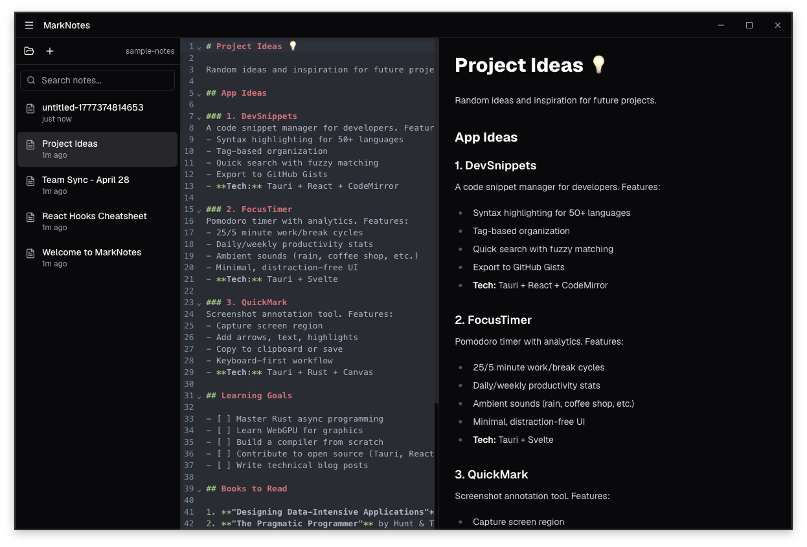

# MarkNotes

A fast, native markdown notes app built with Tauri 2. Clean interface, live preview, and blazingly small (~4MB installed).


## Features

- ✍️ **CodeMirror 6 Editor** — Syntax highlighting for markdown
- 👁️ **Live Preview** — See rendered markdown as you type
- 📁 **File-based** — Notes stored as `.md` files in `~/Documents/MarkNotes`
- 💾 **Auto-save** — Changes saved automatically (500ms debounce)
- 🎨 **Dark/Light Theme** — System-aware with manual toggle
- ⚡ **Blazingly Fast** — Native performance, instant startup
- 🪶 **Tiny Bundle** — 2MB installer, 4MB installed (vs Electron's 150MB+)
- 🔍 **Search** — Filter notes by filename
- ⌨️ **Keyboard Shortcuts** — `Cmd+N`, `Cmd+S`, `Cmd+F`
- 🪟 **Resizable Panels** — Adjust editor/preview split
- 💾 **Window State** — Remembers size and position

## Screenshots

### Main Interface


*Clean, distraction-free interface with live markdown preview*

### Demo Video
[Watch the demo](screenshots/demo.mov) — See MarkNotes in action with live editing, auto-save, and search

## Installation

### macOS (Apple Silicon)

Download the latest `.dmg` from [Releases](https://github.com/TheShahnawaaz/marknotes/releases).

### Windows

Download the latest `.msi` from [Releases](https://github.com/TheShahnawaaz/marknotes/releases).

## Development

### Prerequisites

- [Node.js](https://nodejs.org/) (v18+)
- [Rust](https://rustup.rs/) (latest stable)
- [Tauri CLI](https://tauri.app/v1/guides/getting-started/prerequisites)

### Setup

```bash
# Clone the repo
git clone https://github.com/TheShahnawaaz/marknotes.git
cd marknotes

# Install dependencies
npm install

# Run in development mode
npm run tauri dev
```

### Build

```bash
npm run tauri build
```

Output: `src-tauri/target/release/bundle/`

## Tech Stack

- **Frontend:** React 18 + TypeScript + Vite
- **Editor:** CodeMirror 6
- **Markdown:** react-markdown + remark-gfm + rehype-highlight
- **UI:** shadcn/ui + Tailwind CSS v4
- **Font:** Geist (variable)
- **State:** Zustand
- **Backend:** Tauri 2 + Rust
- **Plugins:** fs, dialog, store, window-state

## Architecture

```
React UI  →  Tauri IPC  →  Rust Commands  →  Filesystem
```

All file operations go through Rust for security. The frontend never touches the filesystem directly.

## Keyboard Shortcuts

| Shortcut | Action |
|----------|--------|
| `Cmd/Ctrl+N` | New note |
| `Cmd/Ctrl+S` | Force save |
| `Cmd/Ctrl+F` | Focus search |

## Why Tauri?

- **10-50x smaller** than Electron apps
- **Native performance** — no Chromium overhead
- **Secure by default** — sandboxed filesystem access
- **Fast startup** — instant, no JS engine warmup

## Contributing

Contributions welcome! Please open an issue first to discuss what you'd like to change.

## License

MIT © [Shahnawaaz](https://github.com/TheShahnawaaz)

## Acknowledgments

- Built with [Tauri](https://tauri.app/)
- UI components from [shadcn/ui](https://ui.shadcn.com/)
- Font by [Vercel](https://vercel.com/font)
